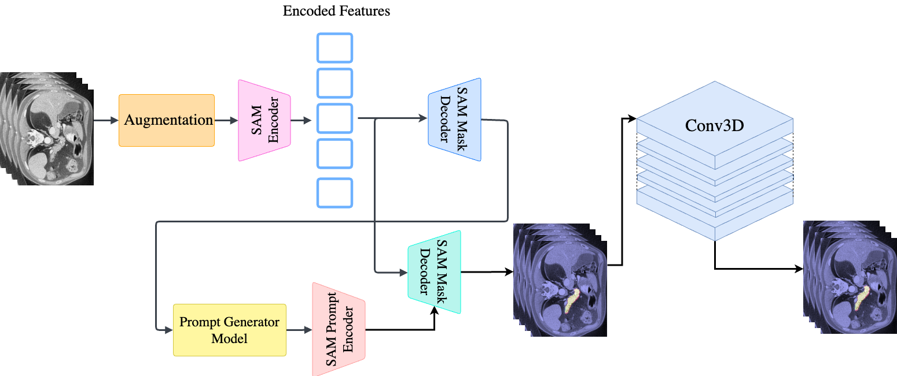

# Pancreas Segmentation in CT Scan Images: Harnessing the Power of SAM

  

In this repositpry we describe the code impelmentation of the paper: "Pancreas Segmentation in CT Scan Images: Harnessing the Power of SAM"

## Requirments
Frist step is install (requirements.txt)[requirements.txt] bakages in a conda eviroment.

## Dadaset and data loader description
For this segmentation report we used to populare pancreas datas:
- [NIH pancreas CT](https://wiki.cancerimagingarchive.net/display/Public/Pancreas-CT)
- [AbdomenCT-1K](https://github.com/JunMa11/AbdomenCT-1K)
